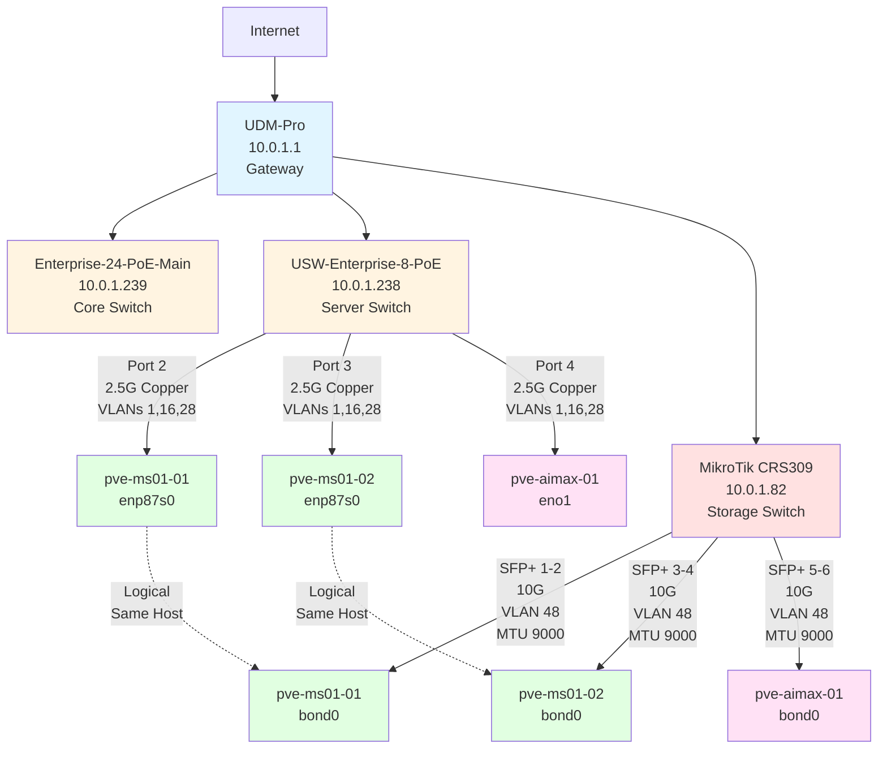
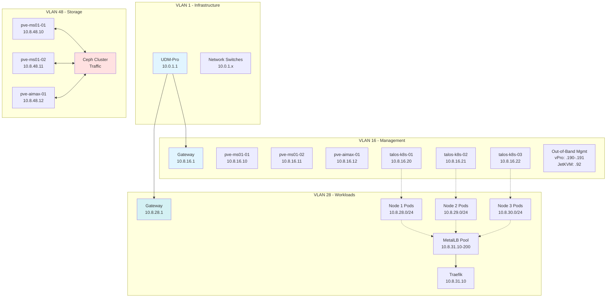

# Network Reference Guide

**Comprehensive network documentation for the Proxmox homelab cluster**

This document consolidates all VLANs, subnets, IP allocations, interface configurations, and network topology information for the entire homelab infrastructure.

---

## Table of Contents

1. [Network Overview](#network-overview)
2. [VLAN Design](#vlan-design)
3. [IP Allocation Tables](#ip-allocation-tables)
4. [Hardware Interface Configuration](#hardware-interface-configuration)
5. [Network Topology](#network-topology)
6. [Switch Configuration](#switch-configuration)
7. [Routing and Firewall](#routing-and-firewall)
8. [Quick Reference](#quick-reference)

---

## Network Overview

### Design Philosophy

The network uses a **simplified 4-VLAN architecture** that balances security with operational simplicity:

- **VLAN 1:** Infrastructure devices (switches, gateway)
- **VLAN 16:** Combined management for Proxmox hosts and Talos VMs
- **VLAN 28:** Combined workload network for Kubernetes pods and LoadBalancer IPs
- **VLAN 48:** Dedicated storage network for Ceph with jumbo frames

### Key Benefits

- **Simplified Management:** Fewer VLANs to maintain vs. original 7-VLAN plan
- **Performance:** Dedicated 10GbE storage network with MTU 9000
- **Security:** Proper isolation between management, workload, and storage traffic
- **Scalability:** Room for 1024 pod IPs + 190 LoadBalancer IPs in VLAN 28

---

## VLAN Design

### VLAN Summary

| VLAN ID | Name | Subnet | Gateway | Purpose | MTU | Notes |
|---------|------|--------|---------|---------|-----|-------|
| **1** | Infrastructure | 10.0.1.0/24 | 10.0.1.1 | Network devices | 1500 | Switches, APs, UDM-Pro |
| **16** | Management | 10.8.16.0/24 | 10.8.16.1 | Proxmox + Talos | 1500 | Web UI, SSH, APIs, OOB mgmt |
| **28** | Workloads | 10.8.28.0/22 | 10.8.28.1 | Pods + LoadBalancer | 1500 | 1024 IPs total |
| **48** | Storage | 10.8.48.0/24 | N/A (isolated) | Ceph cluster | 9000 | Jumbo frames, no routing |

### Removed VLANs (Simplified Design)

These VLANs were removed from the original plan for simplicity:

| VLAN ID | Original Purpose | Why Removed |
|---------|------------------|-------------|
| ~~18~~ | K8s Control Plane VIP | Direct endpoint connection is sufficient (10.8.16.20:6443) |
| ~~58~~ | LoadBalancer Pool | Merged into VLAN 28 for simplified routing |

---

### VLAN 1 - Infrastructure (10.0.1.0/24)

**Purpose:** Network infrastructure management

#### Reserved Ranges
| Range | Purpose |
|-------|---------|
| 10.0.1.1 | UDM-Pro Gateway |
| 10.0.1.2-50 | Network infrastructure (switches, APs, controllers) |
| 10.0.1.51-100 | Server management IPs (reserved, not currently used) |
| 10.0.1.101-200 | DHCP pool for clients |
| 10.0.1.201-254 | Static assignments |

#### Current Assignments
| IP Address | Device | Type | Notes |
|------------|--------|------|-------|
| 10.0.1.1 | UDM-Pro | Router/Gateway | Core gateway |
| 10.0.1.80 | USW-Flex-2.5G-K8s-Main | Switch | Legacy K8s switch |
| 10.0.1.82 | MikroTik-CRS309-Storage | Switch | 10GbE storage switch |
| 10.0.1.238 | USW-Enterprise-8-PoE-Server | Switch | Server connectivity |
| 10.0.1.239 | Enterprise-24-PoE-Main | Switch | Core routing |

---

### VLAN 16 - Management Network (10.8.16.0/24)

**Purpose:** Unified management for Proxmox hosts, Talos VMs, and out-of-band management

#### Functions
- Proxmox web interface (port 8006)
- SSH access to Proxmox hosts
- Cluster communication (corosync)
- Talos API and kubectl access
- Out-of-band management (vPro, JetKVM)

#### IP Allocation Table

##### Proxmox Hosts
| IP Address | Hostname | Interface | Purpose |
|------------|----------|-----------|---------|
| 10.8.16.10 | pve-ms01-01 | enp87s0 | Proxmox Host 1 Management |
| 10.8.16.11 | pve-ms01-02 | enp87s0 | Proxmox Host 2 Management |
| 10.8.16.12 | pve-aimax-01 | eno1 | Proxmox Host 3 Management |

##### Talos Kubernetes VMs
| IP Address | Hostname | Interface | Purpose |
|------------|----------|-----------|---------|
| 10.8.16.20 | talos-k8s-01 | eth0 | Talos VM 1 (K8s API endpoint) |
| 10.8.16.21 | talos-k8s-02 | eth0 | Talos VM 2 |
| 10.8.16.22 | talos-k8s-03 | eth0 | Talos VM 3 |

##### Out-of-Band Management
| IP Address | Hostname | Type | Purpose | Status |
|------------|----------|------|---------|--------|
| 10.8.16.92 | pve-aimax-01-kvm | JetKVM | Framework Desktop KVM-over-IP | Hardware on order |
| 10.8.16.190 | pve-ms01-01-vpro | Intel vPro/AMT 16.1 | MS-01 Node 1 OOB | ✅ Configured (K8s project) |
| 10.8.16.191 | pve-ms01-02-vpro | Intel vPro/AMT 16.1 | MS-01 Node 2 OOB | ✅ Configured (K8s project) |

##### Reserved Ranges
| Range | Purpose |
|-------|---------|
| 10.8.16.1 | Gateway (UDM-Pro) |
| 10.8.16.10-12 | Proxmox hosts |
| 10.8.16.20-22 | Talos VMs |
| 10.8.16.92, 190-191 | Out-of-band management |
| 10.8.16.100-189 | Reserved for additional VMs |
| 10.8.16.192-254 | Reserved for future expansion |

---

### VLAN 28 - Workload Network (10.8.28.0/22)

**Purpose:** VLAN-backed Kubernetes pod networking and MetalLB LoadBalancer IPs

#### Key Features
- **Subnet Size:** /22 provides 1024 usable IPs
- **Per-Node Allocation:** Each Talos node gets a /24 subnet for its pods
- **LoadBalancer Pool:** 190 IPs for MetalLB (10.8.31.10-200)
- **CNI:** Cilium in native routing mode (no overlay)
- **Routing:** Direct routing via UDM-Pro between VLAN 28 and other VLANs

#### Subnet Breakdown

| Range | Node/Purpose | IPs Available | Notes |
|-------|--------------|---------------|-------|
| 10.8.28.0/24 | talos-k8s-01 pods | 254 | Node 1 pod subnet |
| 10.8.29.0/24 | talos-k8s-02 pods | 254 | Node 2 pod subnet |
| 10.8.30.0/24 | talos-k8s-03 pods | 254 | Node 3 pod subnet |
| 10.8.31.1-9 | Reserved | 9 | Reserved for future use |
| **10.8.31.10-200** | **MetalLB Pool** | **190** | **LoadBalancer IPs** |
| 10.8.31.201-254 | Reserved | 54 | Reserved for expansion |

#### Talos VM Workload Interfaces

| Node | Interface | IP Address | Pod Subnet | Purpose |
|------|-----------|------------|------------|---------|
| talos-k8s-01 | eth1 | 10.8.28.1 | 10.8.28.0/24 | CNI + MetalLB binding |
| talos-k8s-02 | eth1 | 10.8.29.1 | 10.8.29.0/24 | CNI + MetalLB binding |
| talos-k8s-03 | eth1 | 10.8.30.1 | 10.8.30.0/24 | CNI + MetalLB binding |

#### MetalLB LoadBalancer Assignments (Planned)

| Service | IP Address | Port(s) | Purpose |
|---------|------------|---------|---------|
| Traefik Ingress | 10.8.31.10 | 80, 443 | Main HTTP/HTTPS ingress |
| Kubernetes Dashboard | 10.8.31.11 | 443 | K8s web UI |
| Grafana | 10.8.31.12 | 80, 443 | Monitoring dashboard |
| Prometheus | 10.8.31.13 | 9090 | Metrics collection |
| _Available Pool_ | 10.8.31.14-200 | - | 187 IPs for services |

---

### VLAN 48 - Storage Network (10.8.48.0/24)

**Purpose:** Dedicated Ceph cluster traffic with high throughput and low latency

#### Key Features
- **MTU:** 9000 (jumbo frames enabled)
- **Physical:** Bonded 10GbE connections (LACP 802.3ad)
- **Bandwidth:** 20 Gbps aggregate per node (2x 10GbE bonded)
- **Isolation:** No inter-VLAN routing (storage-only network)

#### IP Allocations

| IP Address | Hostname | Interface | Purpose |
|------------|----------|-----------|---------|
| 10.8.48.10 | pve-ms01-01-storage | bond0 | MS-01 Node 1 Storage (bonded 2x 10GbE SFP+) |
| 10.8.48.11 | pve-ms01-02-storage | bond0 | MS-01 Node 2 Storage (bonded 2x 10GbE SFP+) |
| 10.8.48.12 | pve-aimax-01-storage | bond0 | Framework Desktop Storage (bonded 2x 10GbE RJ45) |

#### Reserved Ranges
| Range | Purpose |
|-------|---------|
| 10.8.48.20-30 | Ceph monitor IPs (if needed) |
| 10.8.48.200-254 | Reserved for expansion |

---

## IP Allocation Tables

### Complete IP Inventory

#### Proxmox Host IPs (All Interfaces)

##### pve-ms01-01 (Minisforum MS-01 Node 1)
| Interface | VLAN | IP Address | Subnet | Gateway | Purpose |
|-----------|------|------------|--------|---------|---------|
| enp87s0 | 16 | 10.8.16.10 | 10.8.16.0/24 | 10.8.16.1 | Proxmox Management |
| enp88s0 | 1 | 10.0.1.x (DHCP) | 10.0.1.0/24 | 10.0.1.1 | Optional secondary interface |
| bond0 | 48 | 10.8.48.10 | 10.8.48.0/24 | - | Ceph Storage (MTU 9000) |
| vPro/AMT | 16 | 10.8.16.190 | 10.8.16.0/24 | 10.8.16.1 | Out-of-band Management |

**Bond0 Members:** enp2s0f0np0 + enp2s0f1np1 (2x 10GbE SFP+, LACP)

##### pve-ms01-02 (Minisforum MS-01 Node 2)
| Interface | VLAN | IP Address | Subnet | Gateway | Purpose |
|-----------|------|------------|--------|---------|---------|
| enp87s0 | 16 | 10.8.16.11 | 10.8.16.0/24 | 10.8.16.1 | Proxmox Management |
| enp88s0 | 1 | 10.0.1.x (DHCP) | 10.0.1.0/24 | 10.0.1.1 | Optional secondary interface |
| bond0 | 48 | 10.8.48.11 | 10.8.48.0/24 | - | Ceph Storage (MTU 9000) |
| vPro/AMT | 16 | 10.8.16.191 | 10.8.16.0/24 | 10.8.16.1 | Out-of-band Management |

**Bond0 Members:** enp2s0f0np0 + enp2s0f1np1 (2x 10GbE SFP+, LACP)

##### pve-aimax-01 (Framework Desktop 128GB)
| Interface | VLAN | IP Address | Subnet | Gateway | Purpose |
|-----------|------|------------|--------|---------|---------|
| eno1 | 16 | 10.8.16.12 | 10.8.16.0/24 | 10.8.16.1 | Proxmox Management |
| eno1 | 1 | 10.0.1.x (DHCP) | 10.0.1.0/24 | 10.0.1.1 | Optional secondary interface |
| bond0 | 48 | 10.8.48.12 | 10.8.48.0/24 | - | Ceph Storage (MTU 9000) |
| JetKVM | 16 | 10.8.16.92 | 10.8.16.0/24 | 10.8.16.1 | Out-of-band Management |

**Bond0 Members:** enp1s0f0 + enp1s0f1 (2x 10GbE RJ45, LACP)

---

#### Talos Kubernetes VM IPs (All Interfaces)

##### talos-k8s-01 (VM ID 101, on pve-ms01-01)
| Interface | Type | VLAN | IP Address | Subnet | Purpose |
|-----------|------|------|------------|--------|---------|
| eth0 | VirtIO | 16 | 10.8.16.20 | 10.8.16.0/24 | Talos API, kubectl, K8s API endpoint |
| eth1 | VirtIO | 28 | 10.8.28.1 | 10.8.28.0/24 | Pod subnet + MetalLB binding |

**Pod Subnet:** 10.8.28.0/24 (254 pods)

##### talos-k8s-02 (VM ID 102, on pve-ms01-02)
| Interface | Type | VLAN | IP Address | Subnet | Purpose |
|-----------|------|------|------------|--------|---------|
| eth0 | VirtIO | 16 | 10.8.16.21 | 10.8.16.0/24 | Talos API, kubectl |
| eth1 | VirtIO | 28 | 10.8.29.1 | 10.8.29.0/24 | Pod subnet + MetalLB binding |

**Pod Subnet:** 10.8.29.0/24 (254 pods)

##### talos-k8s-03 (VM ID 103, on pve-aimax-01)
| Interface | Type | VLAN | IP Address | Subnet | Purpose |
|-----------|------|------|------------|--------|---------|
| eth0 | VirtIO | 16 | 10.8.16.22 | 10.8.16.0/24 | Talos API, kubectl |
| eth1 | VirtIO | 28 | 10.8.30.1 | 10.8.30.0/24 | Pod subnet + MetalLB binding |

**Pod Subnet:** 10.8.30.0/24 (254 pods)

---

#### Network Infrastructure Devices

| IP Address | Hostname | Type | Location | VLAN | Notes |
|------------|----------|------|----------|------|-------|
| 10.0.1.1 | UDM-Pro | Gateway/Router | Rack | 1 | Core gateway |
| 10.0.1.80 | USW-Flex-2.5G | Switch | Server Rack | 1 | Legacy K8s switch (may repurpose) |
| 10.0.1.82 | MikroTik-CRS309 | Storage Switch | Server Rack | 1 | 10GbE storage network |
| 10.0.1.238 | USW-Enterprise-8-PoE | Server Switch | Server Rack | 1 | Server connectivity |
| 10.0.1.239 | Enterprise-24-PoE | Main Switch | Server Rack | 1 | Core routing |

---

## Hardware Interface Configuration

### Physical Network Interfaces

#### pve-ms01-01 (Minisforum MS-01 Node 1)

| Interface | Type | Speed | MAC Address | Physical Port | Purpose |
|-----------|------|-------|-------------|---------------|---------|
| enp87s0 | RJ45 (Intel i226-V) | 2.5GbE | _TBD_ | Built-in Port 1 | Management (VLAN 16) |
| enp88s0 | RJ45 (Intel i226-V) | 2.5GbE | _TBD_ | Built-in Port 2 | Secondary (VLAN 1, optional) |
| enp2s0f0np0 | SFP+ (Intel X710) | 10GbE | _TBD_ | PCIe Card Port 1 | Storage Bond Member 1 |
| enp2s0f1np1 | SFP+ (Intel X710) | 10GbE | _TBD_ | PCIe Card Port 2 | Storage Bond Member 2 |

#### pve-ms01-02 (Minisforum MS-01 Node 2)

| Interface | Type | Speed | MAC Address | Physical Port | Purpose |
|-----------|------|-------|-------------|---------------|---------|
| enp87s0 | RJ45 (Intel i226-V) | 2.5GbE | _TBD_ | Built-in Port 1 | Management (VLAN 16) |
| enp88s0 | RJ45 (Intel i226-V) | 2.5GbE | _TBD_ | Built-in Port 2 | Secondary (VLAN 1, optional) |
| enp2s0f0np0 | SFP+ (Intel X710) | 10GbE | _TBD_ | PCIe Card Port 1 | Storage Bond Member 1 |
| enp2s0f1np1 | SFP+ (Intel X710) | 10GbE | _TBD_ | PCIe Card Port 2 | Storage Bond Member 2 |

#### pve-aimax-01 (Framework Desktop 128GB)

| Interface | Type | Speed | MAC Address | Physical Port | Purpose |
|-----------|------|-------|-------------|---------------|---------|
| eno1 | RJ45 (Realtek 2.5GbE) | 2.5GbE | _TBD_ | Built-in | Management (VLAN 16) |
| enp1s0f0 | RJ45 (Intel X550-T2) | 10GbE | _TBD_ | PCIe Card Port 1 | Storage Bond Member 1 |
| enp1s0f1 | RJ45 (Intel X550-T2) | 10GbE | _TBD_ | PCIe Card Port 2 | Storage Bond Member 2 |

---

### Bond Configuration (LACP 802.3ad)

#### Storage Network Bonds

##### pve-ms01-01 Storage Bond
```
Bond: bond0
Mode: 802.3ad (LACP)
Members: enp2s0f0np0, enp2s0f1np1
Speed: 2x 10GbE = 20 Gbps aggregate
MTU: 9000 (jumbo frames)
VLAN: 48
IP: 10.8.48.10
```

##### pve-ms01-02 Storage Bond
```
Bond: bond0
Mode: 802.3ad (LACP)
Members: enp2s0f0np0, enp2s0f1np1
Speed: 2x 10GbE = 20 Gbps aggregate
MTU: 9000 (jumbo frames)
VLAN: 48
IP: 10.8.48.11
```

##### pve-aimax-01 Storage Bond
```
Bond: bond0
Mode: 802.3ad (LACP)
Members: enp1s0f0, enp1s0f1
Speed: 2x 10GbE = 20 Gbps aggregate
MTU: 9000 (jumbo frames)
VLAN: 48
IP: 10.8.48.12
```

---

## Network Topology

### Physical Topology Diagram



---

### Logical VLAN Diagram



---

## Switch Configuration

### Port Assignments

#### USW-Enterprise-8-PoE-Server (10.0.1.238)

| Port | Device | Speed | VLAN Mode | VLANs | MTU | Notes |
|------|--------|-------|-----------|-------|-----|-------|
| 1 | Uplink to Main Switch | 10G SFP+ | Trunk | All | 1500 | Fiber uplink |
| 2 | pve-ms01-01 (enp87s0) | 2.5G | Tagged | **1, 16, 28** | 1500 | Management + Workload |
| 3 | pve-ms01-02 (enp87s0) | 2.5G | Tagged | **1, 16, 28** | 1500 | Management + Workload |
| 4 | pve-aimax-01 (eno1) | 2.5G | Tagged | **1, 16, 28** | 1500 | Management + Workload |
| 5-8 | Available | - | - | - | - | Future expansion |

**VLAN Tagging:**
- VLAN 1: Optional secondary interface access
- VLAN 16: Proxmox management, Talos VM management
- VLAN 28: Talos VM workload interfaces (pods + LoadBalancer)

---

#### MikroTik CRS309-1G-8S+IN (10.0.1.82)

| Port | Device | Speed | VLAN Mode | VLANs | MTU | Notes |
|------|--------|-------|-----------|-------|-----|-------|
| SFP+ 1 | pve-ms01-01 (enp2s0f0np0) | 10G | Tagged | **48** | 9000 | Bond Member 1 |
| SFP+ 2 | pve-ms01-01 (enp2s0f1np1) | 10G | Tagged | **48** | 9000 | Bond Member 2 |
| SFP+ 3 | pve-ms01-02 (enp2s0f0np0) | 10G | Tagged | **48** | 9000 | Bond Member 1 |
| SFP+ 4 | pve-ms01-02 (enp2s0f1np1) | 10G | Tagged | **48** | 9000 | Bond Member 2 |
| SFP+ 5 | pve-aimax-01 (enp1s0f0) | 10G | Tagged | **48** | 9000 | Bond Member 1 (RJ45 SFP+) |
| SFP+ 6 | pve-aimax-01 (enp1s0f1) | 10G | Tagged | **48** | 9000 | Bond Member 2 (RJ45 SFP+) |
| SFP+ 7 | Uplink to Main Switch | 10G | Trunk | All | 1500 | Fiber uplink |
| SFP+ 8 | Available | - | - | - | - | Future expansion |
| ether1 | Management | 1G | Native | **1** | 1500 | Switch management port |

**Important:** Jumbo frames (MTU 9000) enabled on all storage ports

---

### UniFi Port Profiles (Recommended)

#### For USW-Enterprise-8-PoE-Server:

**Profile: "Proxmox-Management"**
```
Name: Proxmox-Management
Native VLAN: None (all tagged)
Tagged VLANs: 1, 16, 28
PoE: Disabled
Speed: 2.5 Gbps
```

Apply to ports 2, 3, 4 (Proxmox host management interfaces)

---

### MikroTik LACP Configuration

Each pair of storage ports must be configured in the same LAG (Link Aggregation Group):

```routeros
# Node 1 LAG (Ports 1-2)
/interface bonding add name=lag-ms01-01 mode=802.3ad slaves=sfp-sfpplus1,sfp-sfpplus2

# Node 2 LAG (Ports 3-4)
/interface bonding add name=lag-ms01-02 mode=802.3ad slaves=sfp-sfpplus3,sfp-sfpplus4

# Node 3 LAG (Ports 5-6)
/interface bonding add name=lag-aimax-01 mode=802.3ad slaves=sfp-sfpplus5,sfp-sfpplus6
```

---

## Routing and Firewall

### Inter-VLAN Routing

All inter-VLAN routing is handled by **UDM-Pro (10.0.1.1)**.

### Firewall Rules (Recommended)

#### VLAN 16 → VLAN 48 (Management → Storage)
```
Action: ALLOW
Source: 10.8.16.0/24
Destination: 10.8.48.0/24
Protocol: All
Purpose: Required for VM storage access and Ceph operations
Logging: Disabled (high-volume traffic)
```

#### VLAN 28 → VLAN 16 (Workloads → Management)

**DENY Rules (Security):**
```
1. DENY: 10.8.28.0/22 → 10.8.16.10-12:8006
   Purpose: Block pod access to Proxmox web UI

2. DENY: 10.8.28.0/22 → 10.8.16.10-12:22
   Purpose: Block pod SSH to Proxmox hosts

3. DENY: 10.8.28.0/22 → 10.8.16.92
   Purpose: Block pod access to JetKVM

4. DENY: 10.8.28.0/22 → 10.8.16.190-191
   Purpose: Block pod access to vPro/AMT interfaces
```

**ALLOW Rules (Required):**
```
5. ALLOW: 10.8.28.0/22 → 10.8.16.20-22:50000
   Purpose: Pods can reach Talos API

6. ALLOW: 10.8.28.0/22 → 10.8.16.20-22:6443
   Purpose: Pods can reach Kubernetes API

7. ALLOW: All other traffic
   Purpose: General VM-to-VM communication
```

#### VLAN 28 → Internet
```
ALLOW: Outbound HTTP/HTTPS (80, 443)
ALLOW: DNS (53)
ALLOW: NTP (123)
ALLOW: Common services as needed
```

#### VLAN 48 (Storage)
```
DENY: All inter-VLAN routing except from VLAN 16
ISOLATED: Storage traffic stays on VLAN 48 only
DENY: All outbound Internet traffic
```

#### VLAN 1 → All
```
ALLOW: Infrastructure devices can reach all VLANs for management
```

---

### UDM-Pro Static Routes (Optional)

If UDM-Pro doesn't automatically learn pod subnets, add these static routes:

```
# Pod network routing via Talos VM management IPs
10.8.28.0/24 via 10.8.16.20  (talos-k8s-01 pods)
10.8.29.0/24 via 10.8.16.21  (talos-k8s-02 pods)
10.8.30.0/24 via 10.8.16.22  (talos-k8s-03 pods)

# LoadBalancer pool (MetalLB uses L2, may not need static route)
10.8.31.0/24 via 10.8.16.20  (announced via L2 by MetalLB)
```

**Note:** MetalLB uses L2 advertisement, so UDM-Pro may learn routes via ARP automatically.

---

## Quick Reference

### Access Points

| Service | URL/Endpoint | Port | Credentials |
|---------|--------------|------|-------------|
| **Proxmox (Node 1)** | https://10.8.16.10:8006 | 8006 | root / configured |
| **Proxmox (Node 2)** | https://10.8.16.11:8006 | 8006 | root / configured |
| **Proxmox (Node 3)** | https://10.8.16.12:8006 | 8006 | root / configured |
| **vPro (Node 1)** | https://10.8.16.190:16992 | 16992 | admin / configured |
| **vPro (Node 2)** | https://10.8.16.191:16992 | 16992 | admin / configured |
| **JetKVM (Node 3)** | https://10.8.16.92 | 443 | admin / TBD |
| **Kubernetes API** | https://10.8.16.20:6443 | 6443 | kubeconfig |
| **Traefik Dashboard** | http://10.8.31.10:9000/dashboard/ | 9000 | N/A |
| **Grafana** | http://10.8.31.12 | 80 | admin / configured |

---

### SSH Access

```bash
# Proxmox hosts
ssh root@10.8.16.10  # pve-ms01-01
ssh root@10.8.16.11  # pve-ms01-02
ssh root@10.8.16.12  # pve-aimax-01

# Talos VMs (no SSH - use talosctl)
talosctl --nodes 10.8.16.20 dashboard
talosctl --nodes 10.8.16.21 dashboard
talosctl --nodes 10.8.16.22 dashboard
```

---

### Command Reference

#### Network Testing

```bash
# Test jumbo frames (storage network)
ping -M do -s 8972 -c 10 10.8.48.11

# Test storage throughput (iperf3)
# On target:
iperf3 -s -B 10.8.48.11

# On source:
iperf3 -c 10.8.48.11 -B 10.8.48.10 -t 30 -P 4

# Check bond status
cat /proc/net/bonding/bond0

# Verify VLAN configuration
ip addr show
bridge vlan show
```

#### Network Diagnostics

```bash
# Check interface status
ip link show

# Check routing table
ip route show

# Check ARP table
ip neigh show

# Test connectivity
ping 10.8.16.1  # Gateway
ping 10.8.48.11 # Storage network
```

---

### Network Performance Targets

| Metric | Target | Notes |
|--------|--------|-------|
| Management Network | 2.5 Gbps | Copper Cat6 |
| Storage Network (per link) | 10 Gbps | SFP+ DAC or RJ45 |
| Storage Network (bonded) | 20 Gbps | LACP aggregate |
| Host-to-host latency (same VLAN) | < 0.5ms | Local network |
| VM-to-VM latency (same host) | < 0.1ms | Virtual switch |
| VM-to-VM latency (different host) | < 1ms | Physical network |
| Storage network latency | < 0.5ms | Critical for Ceph |

---

### Common Troubleshooting

#### Jumbo Frames Not Working
- Verify MTU on all devices in path (NICs, switch ports, bond)
- Check switch VLAN configuration allows large frames
- Ensure no intermediate devices have MTU 1500 limitation

#### LACP Bond Not Forming
- Verify switch has LACP enabled on ports
- Check both bond members are on same switch
- Ensure switch ports are in same port-channel/LAG

#### Inter-VLAN Routing Issues
- Verify VLAN interfaces configured on UDM-Pro
- Check firewall rules allow desired traffic
- Confirm routing table on UDM-Pro

#### Slow Storage Performance
- Check bond status (both members active?)
- Verify jumbo frames enabled and working
- Monitor switch port statistics for errors
- Test with iperf3 to isolate storage vs. network

---

### VLAN Cheat Sheet

| Need to... | Use VLAN | Gateway | Typical Port |
|------------|----------|---------|--------------|
| Access Proxmox web UI | 16 | 10.8.16.1 | 8006 |
| SSH to Proxmox host | 16 | 10.8.16.1 | 22 |
| Access vPro/AMT | 16 | 10.8.16.1 | 16992 |
| Access Kubernetes API | 16 | 10.8.16.1 | 6443 (on 10.8.16.20) |
| Access K8s LoadBalancer services | 28 | 10.8.28.1 | Varies |
| Ceph storage traffic | 48 | None | 6789, 6800-7300 |
| Manage switches | 1 | 10.0.1.1 | 80/443 |

---

### Migration from Old IPs

If migrating from a previous setup, refer to these changes:

| Component | Old IP | New IP | Notes |
|-----------|--------|--------|-------|
| Proxmox management VLAN | 20 | **16** | Consolidated with Talos |
| Talos management VLAN | 40 | **16** | Consolidated with Proxmox |
| K8s control plane VIP VLAN | ~~18~~ | **Removed** | Use direct endpoint |
| Storage VLAN | 30 | **48** | Renumbered |
| LoadBalancer VLAN | ~~58~~ | **Merged into 28** | Simplified |
| vPro IPs | K8s: .190/.191 | **No change** | Already configured correctly |

---

## DNS Configuration

### Recommended Local DNS Entries

Create these DNS entries in UDM-Pro or local DNS server:

```
# Proxmox hosts
pve-ms01-01.lab.local       A    10.8.16.10
pve-ms01-02.lab.local       A    10.8.16.11
pve-aimax-01.lab.local      A    10.8.16.12

# Talos VMs
talos-k8s-01.lab.local      A    10.8.16.20
talos-k8s-02.lab.local      A    10.8.16.21
talos-k8s-03.lab.local      A    10.8.16.22

# Kubernetes API
k8s-api.lab.local           A    10.8.16.20

# Services
traefik.lab.local           A    10.8.31.10
grafana.lab.local           A    10.8.31.12
```

---

## Network Monitoring

### Key Metrics to Monitor

- Interface utilization (%)
- Packet loss and errors
- Latency (inter-host ping)
- Bond status and member health
- VLAN traffic distribution
- Storage network throughput

### Recommended Tools

- **UniFi Controller:** Built-in traffic graphs
- **Proxmox:** Built-in network graphs
- **Grafana + Prometheus:** Advanced metrics
- **LibreNMS/Observium:** SNMP monitoring

---

## Appendix

### Port Requirements

#### Proxmox Cluster Ports
| Port | Protocol | Purpose |
|------|----------|---------|
| 22 | TCP | SSH |
| 8006 | TCP | Proxmox Web UI (HTTPS) |
| 5900-5999 | TCP | VNC console |
| 3128 | TCP | SPICE proxy |
| 111 | TCP/UDP | RPC |
| 5404-5405 | UDP | Corosync |

#### Ceph Cluster Ports
| Port | Protocol | Purpose |
|------|----------|---------|
| 6789 | TCP | Ceph Monitor |
| 6800-7300 | TCP | Ceph OSDs |
| 8443 | TCP | Ceph Manager dashboard |

#### Kubernetes Ports
| Port | Protocol | Purpose |
|------|----------|---------|
| 6443 | TCP | Kubernetes API |
| 50000 | TCP | Talos API |
| 2379-2380 | TCP | etcd |

---

**Last Updated:** 2025-11-04
**Document Version:** 1.0
**Maintained By:** Jason

**Related Documentation:**
- Original planning docs archived in `archive/proxmox-planning-2025/`
- Project guidelines: `CLAUDE.md`
