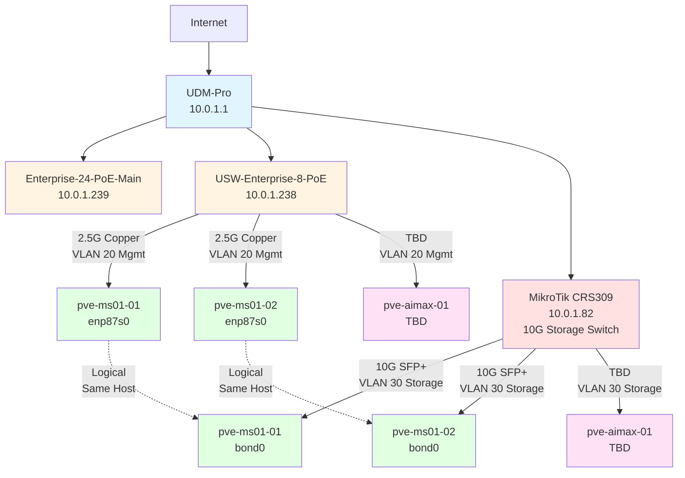
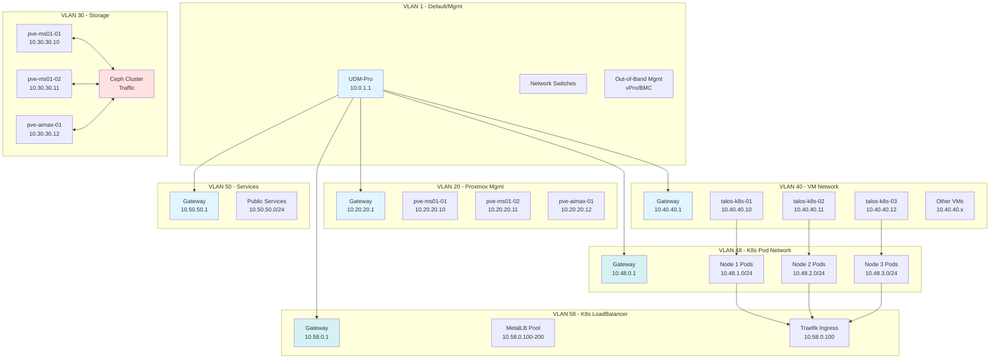
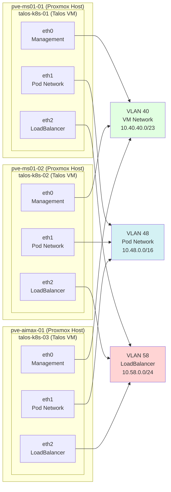

# Proxmox Homelab Network Architecture

## Overview
This document defines the network architecture for the Proxmox homelab cluster, including VLAN segmentation, subnet allocations, routing, and physical network topology.

---

## Design Philosophy

### Simplified VLAN Structure
Unlike the previous Kubernetes deployment which required extensive VLAN segmentation (management, control plane, pod network, service network, storage, load balancer), Proxmox virtualization allows for a more streamlined approach:

- **Management VLAN:** Proxmox web UI, SSH, cluster communication
- **Storage VLAN:** Ceph/shared storage traffic with jumbo frames
- **VM Network VLAN:** Guest VM networking
- **Services VLAN (Optional):** Dedicated network for exposed services

---

## VLAN Configuration

### Current VLAN Structure

**Reusing proven 10.8.x VLANs from previous Kubernetes deployment**

| VLAN ID | Name | Subnet | Gateway | Purpose | MTU |
|---------|------|--------|---------|---------|-----|
| 1 | Default/Infrastructure | 10.0.1.0/24 | 10.0.1.1 | Network infrastructure devices | 1500 |
| **16** | **Proxmox + Talos Management** | **10.8.16.0/24** | **10.8.16.1** | **Proxmox hosts, Talos VMs, out-of-band mgmt** | **1500** |
| **18** | **K8s Control Plane VIP** | **10.8.18.0/24** | **10.8.18.1** | **Optional K8s API VIP (10.8.18.2)** | **1500** |
| **28** | **K8s Pod Network** | **10.8.28.0/23** | **10.8.28.1** | **VLAN-backed pod network (512 IPs)** | **1500** |
| **48** | **Ceph Storage** | **10.8.48.0/24** | **10.8.48.1** | **Proxmox Ceph cluster traffic** | **9000** |
| **58** | **K8s LoadBalancer** | **10.8.58.0/27** | **10.8.58.1** | **MetalLB IP pool (32 IPs)** | **1500** |

**Design Notes:**
- **VLAN 16:** Combined management network for Proxmox and Talos simplifies access
- **VLAN 18:** Reserved for K8s control plane HA (VIP at 10.8.18.2:6443 optional)
- **VLAN 28:** /23 provides 512 IPs for pods (170+ pods per node)
- **VLAN 48:** Jumbo frames (MTU 9000) for Ceph performance
- **VLAN 58:** /27 provides 32 IPs (sufficient for homelab LoadBalancer services)

**Retired VLANs from Old K8s Setup:**
- VLAN 38 (10.8.38.0/26) - Service Network (not needed, K8s services use internal 10.244.0.0/16)

---

## Subnet Allocations

### VLAN 1 - Default/Management (10.0.1.0/24)

#### Reserved Ranges
| Range | Purpose |
|-------|---------|
| 10.0.1.1 | UDM-Pro Gateway |
| 10.0.1.2-10.0.1.50 | Network infrastructure (switches, APs, controllers) |
| 10.0.1.51-10.0.1.100 | Server management IPs (out-of-band, BMC, vPro) |
| 10.0.1.101-10.0.1.200 | DHCP pool for clients |
| 10.0.1.201-10.0.1.254 | Static assignments |

#### Current Assignments
| IP Address | Device | Type |
|------------|--------|------|
| 10.0.1.1 | UDM-Pro | Router/Gateway |
| 10.0.1.80 | USW-Flex-2.5G-K8s-Main | Switch |
| 10.0.1.82 | MikroTik-CRS309-K8s-Storage | Switch |
| 10.0.1.238 | USW-Enterprise-8-PoE-Server | Switch |
| 10.0.1.239 | Enterprise-24-PoE-Main | Switch |
| _TBD_ | pve-ms01-01 vPro | Management |
| _TBD_ | pve-ms01-02 vPro | Management |
| _TBD_ | pve-aimax-01 BMC | Management |

---

### VLAN 20 - Proxmox Management (10.20.20.0/24)

#### Purpose
- Proxmox web interface (port 8006)
- SSH access to Proxmox hosts
- Cluster communication (corosync)
- API access

#### IP Allocations
| IP Address | Hostname | Interface | Purpose |
|------------|----------|-----------|---------|
| 10.20.20.1 | UDM-Pro | VLAN 20 | Gateway |
| 10.20.20.10 | pve-ms01-01 | enp87s0 | Proxmox Host 1 |
| 10.20.20.11 | pve-ms01-02 | enp87s0 | Proxmox Host 2 |
| 10.20.20.12 | pve-aimax-01 | _TBD_ | Proxmox Host 3 |
| 10.20.20.100 | pve-cluster-vip | Virtual IP | Cluster VIP (optional) |
| 10.20.20.200-254 | - | - | Reserved for expansion |

---

### VLAN 30 - Storage Network (10.30.30.0/24)

#### Purpose
- Ceph cluster traffic (OSD, MON, MGR)
- ZFS replication (if used)
- VM disk I/O over iSCSI/NFS (if applicable)
- High-throughput storage traffic

#### Design Notes
- **MTU:** 9000 (jumbo frames enabled)
- **Physical:** Dedicated 10GbE SFP+ connections
- **Bonding:** LACP (802.3ad) for redundancy and throughput
- **No routing:** Isolated to storage network

#### IP Allocations
| IP Address | Hostname | Interface | Purpose |
|------------|----------|-----------|---------|
| 10.30.30.10 | pve-ms01-01-storage | bond0 | Storage Interface |
| 10.30.30.11 | pve-ms01-02-storage | bond0 | Storage Interface |
| 10.30.30.12 | pve-aimax-01-storage | _TBD_ | Storage Interface |
| 10.30.30.20-30 | - | - | Ceph monitor IPs (if needed) |
| 10.30.30.200-254 | - | - | Reserved for expansion |

---

### VLAN 40 - VM Network (10.40.40.0/23)

#### Purpose
- Default network for guest VMs
- Container networking (LXC)
- **Talos OS Kubernetes nodes** (management interface)
- Internal service communication
- /23 provides 512 usable IPs

#### IP Allocations
| Range | Purpose |
|-------|---------|
| 10.40.40.1 | Gateway (UDM-Pro) |
| 10.40.40.2-10.40.40.50 | Static VMs (databases, controllers) |
| **10.40.40.10-10.40.40.12** | **Talos OS K8s nodes (eth0 - API/kubectl)** |
| 10.40.40.51-10.40.40.99 | Static VMs (application servers) |
| 10.40.40.100-10.40.41.254 | DHCP pool for VMs |

---

### VLAN 48 - Kubernetes Pod Network (10.48.0.0/16)

#### Purpose
- **VLAN-backed Kubernetes pod networking**
- Direct routing for pod-to-pod communication (no overlay)
- High-performance pod traffic with native VLAN routing
- CNI binding interface for Talos OS nodes

#### Design Notes
- **Subnet Size:** /16 provides 65,536 usable IPs
- **Per-Node Allocation:** Each Talos node gets a /24 subnet for its pods
  - Node 1: 10.48.1.0/24 (254 pods)
  - Node 2: 10.48.2.0/24 (254 pods)
  - Node 3: 10.48.3.0/24 (254 pods)
- **CNI:** Cilium in native routing mode or Calico with VLAN mode
- **No NAT:** Pods use routable IPs within the cluster
- **Routing:** UDM-Pro routes between pod subnet and other VLANs

#### IP Allocations
| Range | Purpose |
|-------|---------|
| 10.48.0.1 | Gateway (UDM-Pro) |
| 10.48.1.0/24 | Talos node 1 pod subnet (pve-ms01-01) |
| 10.48.2.0/24 | Talos node 2 pod subnet (pve-ms01-02) |
| 10.48.3.0/24 | Talos node 3 pod subnet (pve-aimax-01) |
| 10.48.4.0-10.48.255.0 | Reserved for additional nodes |

#### Talos VM Pod Interface Configuration
| Node | Interface | IP Address | Pod Subnet |
|------|-----------|------------|------------|
| talos-k8s-01 (pve-ms01-01) | eth1 | 10.48.1.1 | 10.48.1.0/24 |
| talos-k8s-02 (pve-ms01-02) | eth1 | 10.48.2.1 | 10.48.2.0/24 |
| talos-k8s-03 (pve-aimax-01) | eth1 | 10.48.3.1 | 10.48.3.0/24 |

---

### VLAN 50 - Services Network (10.50.50.0/24)

#### Purpose
- Public-facing services
- Reverse proxy backends
- DMZ-style isolation
- Services with external access requirements

#### IP Allocations
| Range | Purpose |
|-------|---------|
| 10.50.50.1 | Gateway (UDM-Pro) |
| 10.50.50.10-10.50.50.50 | Reverse proxies (Traefik, Nginx) |
| 10.50.50.51-10.50.50.100 | Web services |
| 10.50.50.101-10.50.50.150 | API services |
| 10.50.50.151-10.50.50.200 | Reserved for expansion |

---

### VLAN 58 - Kubernetes LoadBalancer (10.58.0.0/24)

#### Purpose
- **MetalLB LoadBalancer IP pool**
- External service exposure for Kubernetes
- Dedicated VLAN for LoadBalancer-type services
- MetalLB speaker binding

#### Design Notes
- **MetalLB Mode:** Layer 2 (L2) mode for simplicity
- **Speaker Pods:** Run on each Talos node, bind to eth2 interface
- **IP Announcement:** ARP-based IP advertisement
- **Pool Size:** 100+ IPs available for LoadBalancer services

#### IP Allocations
| Range | Purpose |
|-------|---------|
| 10.58.0.1 | Gateway (UDM-Pro) |
| 10.58.0.10-10.58.0.12 | Talos node MetalLB speaker interfaces (eth2) |
| **10.58.0.100-10.58.0.200** | **MetalLB IP pool (101 IPs available)** |
| 10.58.0.201-10.58.0.254 | Reserved for manual assignments |

#### MetalLB Configuration Example
```yaml
apiVersion: v1
kind: ConfigMap
metadata:
  namespace: metallb-system
  name: config
data:
  config: |
    address-pools:
    - name: default
      protocol: layer2
      addresses:
      - 10.58.0.100-10.58.0.200
```

#### Common LoadBalancer Assignments (Planned)
| Service | IP Address | Port(s) | Purpose |
|---------|------------|---------|---------|
| Traefik Ingress | 10.58.0.100 | 80, 443 | Main HTTP/HTTPS ingress |
| Kubernetes API (optional) | 10.58.0.101 | 6443 | External K8s API access |
| Monitoring (Grafana) | 10.58.0.110 | 80, 443 | Monitoring dashboard |
| _Available_ | 10.58.0.102-10.58.0.200 | - | Future services |

#### Talos VM LoadBalancer Interface Configuration
| Node | Interface | IP Address | Purpose |
|------|-----------|------------|---------|
| talos-k8s-01 (pve-ms01-01) | eth2 | 10.58.0.10 | MetalLB speaker |
| talos-k8s-02 (pve-ms01-02) | eth2 | 10.58.0.11 | MetalLB speaker |
| talos-k8s-03 (pve-aimax-01) | eth2 | 10.58.0.12 | MetalLB speaker |

---

## Network Topology

### Physical Network Diagram



### Logical VLAN Diagram (with Kubernetes)



### Talos VM Network Architecture

This diagram shows how each Talos OS VM connects to multiple VLANs using separate virtual network interfaces:



**Interface Summary:**
- **eth0 (VLAN 40):** Talos API, kubectl access, cluster communication
- **eth1 (VLAN 48):** CNI binding, pod traffic, direct pod routing
- **eth2 (VLAN 58):** MetalLB speaker, LoadBalancer IP announcement

---

## Switch Configuration

### Port Assignments

#### USW-Enterprise-8-PoE-Server (10.0.1.238)
| Port | Device | Speed | VLAN Mode | VLANs | Notes |
|------|--------|-------|-----------|-------|-------|
| 1 | Uplink to Main Switch | 10G SFP+ | Trunk | All | Fiber uplink |
| 2 | pve-ms01-01 (enp87s0) | 2.5G | Tagged | 1,20,40,48,50,58 | Management + VM + K8s networks |
| 3 | pve-ms01-02 (enp87s0) | 2.5G | Tagged | 1,20,40,48,50,58 | Management + VM + K8s networks |
| 4 | pve-aimax-01 | TBD | Tagged | 1,20,40,48,50,58 | Management + VM + K8s networks |
| 5-8 | Available | - | - | - | Future expansion |

#### MikroTik CRS309-1G-8S+IN (10.0.1.82)
| Port | Device | Speed | VLAN Mode | VLANs | Notes |
|------|--------|-------|-----------|-------|-------|
| SFP+ 1 | pve-ms01-01 (enp2s0f0np0) | 10G | Tagged | 30 | Storage - Bond Member 1 |
| SFP+ 2 | pve-ms01-01 (enp2s0f1np1) | 10G | Tagged | 30 | Storage - Bond Member 2 |
| SFP+ 3 | pve-ms01-02 (enp2s0f0np0) | 10G | Tagged | 30 | Storage - Bond Member 1 |
| SFP+ 4 | pve-ms01-02 (enp2s0f1np1) | 10G | Tagged | 30 | Storage - Bond Member 2 |
| SFP+ 5-6 | pve-aimax-01 | TBD | Tagged | 30 | Storage - TBD |
| SFP+ 7 | Uplink to Main Switch | 10G | Trunk | All | Fiber uplink |
| SFP+ 8 | Available | - | - | - | Future expansion |

---

## Bonding Configuration

### Storage Bond (LACP 802.3ad)

#### pve-ms01-01
```
Bond: bond0
Mode: 802.3ad (LACP)
Members: enp2s0f0np0, enp2s0f1np1
Speed: 2x 10GbE = 20 Gbps aggregate
MTU: 9000
VLAN: 30 (10.30.30.10)
```

#### pve-ms01-02
```
Bond: bond0
Mode: 802.3ad (LACP)
Members: enp2s0f0np0, enp2s0f1np1
Speed: 2x 10GbE = 20 Gbps aggregate
MTU: 9000
VLAN: 30 (10.30.30.11)
```

#### pve-aimax-01
```
TBD - Depends on available NICs
```

---

## Routing and Firewall

### Inter-VLAN Routing
All inter-VLAN routing is handled by the UDM-Pro at 10.0.1.1.

### Firewall Rules (Proposed)

#### VLAN 20 → VLAN 30 (Proxmox → Storage)
- **Allow:** All traffic (required for VM storage access)

#### VLAN 40 → VLAN 20 (VMs → Proxmox)
- **Deny:** Direct access to Proxmox management
- **Allow:** Specific services if needed (e.g., NFS, iSCSI)

#### VLAN 50 → Internet
- **Allow:** Outbound HTTPS (443), HTTP (80)
- **Deny:** All other outbound

#### VLAN 30 (Storage)
- **Deny:** All inter-VLAN routing
- **Isolated:** Storage traffic stays on VLAN 30 only

---

## DNS Configuration

### DNS Servers
| Type | IP Address | Provider |
|------|------------|----------|
| Primary DNS | 10.0.1.1 | UDM-Pro (local) |
| Secondary DNS | 1.1.1.1 | Cloudflare |
| Tertiary DNS | 8.8.8.8 | Google |

### Local DNS Zones
Consider creating local DNS entries for:
- `pve-ms01-01.lab.local` → 10.20.20.10
- `pve-ms01-02.lab.local` → 10.20.20.11
- `pve-aimax-01.lab.local` → 10.20.20.12
- `proxmox.lab.local` → Cluster VIP (if configured)

---

## Network Performance Targets

### Expected Throughput
| Link Type | Expected Speed | Technology |
|-----------|---------------|------------|
| Management | 2.5 Gbps | Copper Cat6 |
| Storage (per link) | 10 Gbps | SFP+ DAC/Fiber |
| Storage (bonded) | 20 Gbps | LACP aggregate |
| VM Network | 2.5 Gbps | Shared with management |

### Latency Targets
| Path | Target Latency |
|------|----------------|
| Host to Host (same VLAN) | < 0.5ms |
| VM to VM (same host) | < 0.1ms |
| VM to VM (different host) | < 1ms |
| Storage network | < 0.5ms |

---

## Network Testing

### Commands for Validation

#### Test Jumbo Frames (Storage Network)
```bash
# From pve-ms01-01 to pve-ms01-02
ping -M do -s 8972 -c 10 10.30.30.11
```

#### Test Storage Throughput
```bash
# iperf3 server on pve-ms01-02
iperf3 -s -B 10.30.30.11

# iperf3 client on pve-ms01-01
iperf3 -c 10.30.30.11 -B 10.30.30.10 -t 30 -P 4
```

#### Test Bond Status
```bash
cat /proc/net/bonding/bond0
```

#### Verify VLAN Configuration
```bash
ip addr show
bridge vlan show
```

---

## Network Monitoring

### Recommended Monitoring
- **UniFi Controller:** Built-in traffic graphs and statistics
- **Proxmox:** Built-in network graphs per host and VM
- **LibreNMS/Observium:** SNMP monitoring for switches
- **Grafana + Prometheus:** Advanced metrics and alerting

### Key Metrics to Monitor
- Interface utilization (%)
- Packet loss and errors
- Latency (inter-host ping)
- Bond status and member health
- VLAN traffic distribution
- Storage network throughput

---

## Troubleshooting

### Common Issues

#### Jumbo Frames Not Working
- Verify MTU on all devices in the path (NICs, switch ports, bond)
- Check switch VLAN configuration allows large frames
- Ensure no intermediate devices have MTU 1500 limitation

#### LACP Bond Not Forming
- Verify switch has LACP enabled on ports
- Check both bond members are on the same switch
- Ensure switch ports are in the same port-channel/LAG

#### Inter-VLAN Routing Issues
- Verify VLAN interfaces on UDM-Pro
- Check firewall rules allow desired traffic
- Confirm routing table on UDM-Pro

#### Slow Storage Performance
- Check bond status (both members active?)
- Verify jumbo frames enabled and working
- Monitor switch port statistics for errors
- Test with iperf3 to isolate storage vs. network issues

---

**Last Updated:** 2025-11-03
**Document Version:** 1.0
**Maintained By:** Jason
