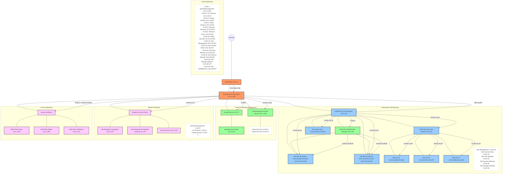

---
config:
  layout: fixed
---

```mermaid
flowchart TD
 subgraph kubernetes["Kubernetes Infrastructure"]
        K8SCONTROL["USW-Flex-Mini-K8s-Control 10.0.1.81"]
        K8SMAIN["USW-Flex-2.5G-K8s-Main 10.0.1.80"]
        MIKROTIK["MikroTik-CRS309-K8s-Storage 10.0.1.82"]
        K8SADMIN["K8s-Admin-Box 10.8.16.85/10.8.18.85"]
        MS01NODE1["K8s-MS-01-Node-1 10.8.16.90/10.8.18.90 vPro:10.8.16.190"]
        MS01NODE2["K8s-MS-01-Node-2 10.8.16.91/10.8.18.91 vPro:10.8.16.191"]
        K8SCP01["K8s-CP-01 10.8.16.86/10.8.18.86"]
        K8SCP02["K8s-CP-02 10.8.16.87/10.8.18.87"]
        K8SCP03["K8s-CP-03 10.8.16.88/10.8.18.88"]
        CONNOTES1["K8s Management: VLAN 16
        K8s Control Plane: VLAN 18
        K8s Pod Network: VLAN 28
        K8s Service Network: VLAN 38
        K8s Storage Network: VLAN 48"]
  end
 subgraph servers["Server & Storage Infrastructure"]
        VAULTBACKUP["Vault-Backup-Unraid 10.0.1.110"]
        UNRAID["Unraid Server 10.0.1.7"]
        SERVNOTE["Reverse-Proxy VLAN 6
        Public Services VLAN 10"]
        ENTSERVER["USW-Enterprise-8-PoE-Server 10.0.1.238"]
  end
 subgraph wireless["Wireless Network"]
        U6LIVING["U6-Enterprise-LivingArea 10.0.1.207"]
        AP_SECTION["Wireless Access Points"]
        U6WALL["U6-Enterprise-IW-Upstairs-Living 10.0.1.227"]
        U6LITE["U6-Lite-Game 10.0.1.242"]
        WIFNOTE["Default Management: VLAN 1
        IoT Devices: VLAN 2
        Family Devices: VLAN 3"]
  end
 subgraph access["Access Networks"]
        FLEXPRINTER["USW-Flex-Printer 10.0.1.204"]
        ACCESS_SECTION["Access Switches"]
        FLEXMEDIA["USW-Flex-Media 10.0.1.208"]
        FLEXSIM["USW-Flex-SimRoom 10.0.1.212"]
  end
 subgraph reference["VLAN Reference"]
        VLAN_TABLE["VLAN 1: Default/Management 10.0.1.0/24
        VLAN 2: IoT Devices 10.0.2.0/24
        VLAN 3: Family Devices 10.0.3.0/24
        VLAN 4: Work Devices 10.0.4.0/24
        VLAN 5: Security Cameras 10.0.5.0/24
        VLAN 6: Reverse Proxy 10.6.6.0/24
        VLAN 10: Public Services 10.10.10.0/24
        VLAN 16: K8s Management 10.8.16.0/27
        VLAN 18: K8s Control Plane 10.8.18.0/27
        VLAN 28: K8s Pod Network 10.8.28.0/23
        VLAN 38: K8s Service Network 10.8.38.0/26
        VLAN 48: K8s Storage Network 10.8.48.0/27
        VLAN 58: K8s LoadBalancer 10.8.58.0/27"]
  end
    INTERNET(("Internet")) --- UDMPRO["UDM-PRO 10.0.1.1"]
    UDMPRO --- MAINSWITCH["Enterprise-24-PoE-Main 10.0.1.239"]
    MAINSWITCH --- K8SMAIN & ENTSERVER & UNRAID & AP_SECTION & ACCESS_SECTION
    K8SMAIN --- K8SCONTROL & MIKROTIK & K8SADMIN & MS01NODE1 & MS01NODE2
    K8SCONTROL --- K8SCP01 & K8SCP02 & K8SCP03
    MIKROTIK --> MS01NODE1 & MS01NODE2
    UNRAID --- VAULTBACKUP
    ENTSERVER --- SERVNOTE
    AP_SECTION --- U6LIVING & U6WALL & U6LITE
    ACCESS_SECTION --- FLEXPRINTER & FLEXMEDIA & FLEXSIM
    UDMPRO -- "All VLANs 1-58" --> MAINSWITCH
    MAINSWITCH -- K8s VLANs --> K8SMAIN
    MAINSWITCH -- VLANs 1,6,10 --> ENTSERVER
    MAINSWITCH -- VLAN 1 --> UNRAID
    MAINSWITCH -- VLANs 1,2,3 --> AP_SECTION
    MAINSWITCH -- VLAN 1 + Device VLANs --> ACCESS_SECTION
    K8SMAIN -- VLANs 16,18 --> K8SCONTROL & K8SADMIN & MS01NODE1 & MS01NODE2
    K8SMAIN -- VLAN 1 --> MIKROTIK
    K8SCONTROL -- VLANs 16,18 --> K8SCP01 & K8SCP02 & K8SCP03
    MIKROTIK -- VLANs 28,38,48 --> MS01NODE1 & MS01NODE2
     K8SCONTROL:::k8sDevices
     K8SMAIN:::k8sDevices
     MIKROTIK:::storageDevices
     K8SADMIN:::k8sDevices
     MS01NODE1:::k8sDevices
     MS01NODE2:::k8sDevices
     K8SCP01:::k8sDevices
     K8SCP02:::k8sDevices
     K8SCP03:::k8sDevices
     CONNOTES1:::notes
     VAULTBACKUP:::storageDevices
     UNRAID:::storageDevices
     SERVNOTE:::notes
     ENTSERVER:::storageDevices
     U6LIVING:::accessDevices
     AP_SECTION:::accessDevices
     U6WALL:::accessDevices
     U6LITE:::accessDevices
     WIFNOTE:::notes
     FLEXPRINTER:::accessDevices
     ACCESS_SECTION:::accessDevices
     FLEXMEDIA:::accessDevices
     FLEXSIM:::accessDevices
     VLAN_TABLE:::notes
     UDMPRO:::coreDevices
     MAINSWITCH:::coreDevices
    classDef coreDevices fill:#f96,stroke:#333,stroke-width:2px
    classDef k8sDevices fill:#9cf,stroke:#333,stroke-width:2px
    classDef storageDevices fill:#9f9,stroke:#333,stroke-width:2px
    classDef accessDevices fill:#fcf,stroke:#333,stroke-width:2px
    classDef notes fill:#fff,stroke:#999,stroke-width:1px,stroke-dasharray:5 5
```