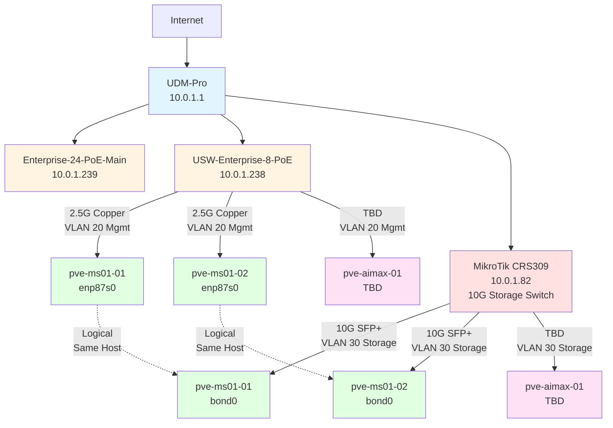
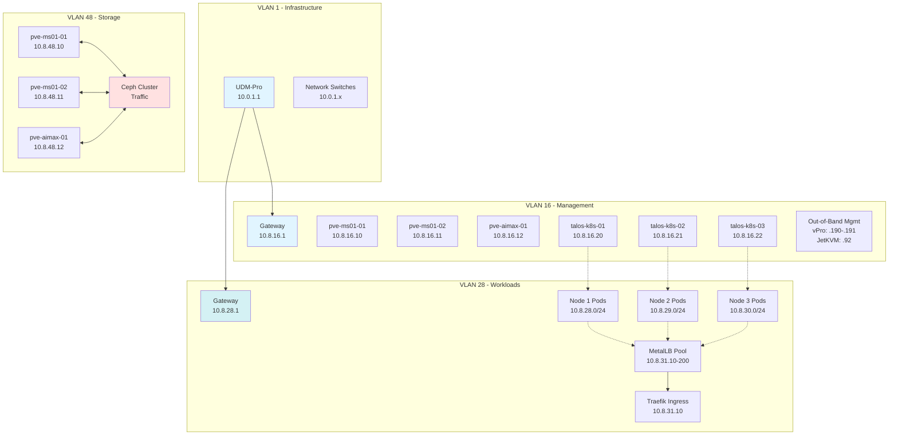
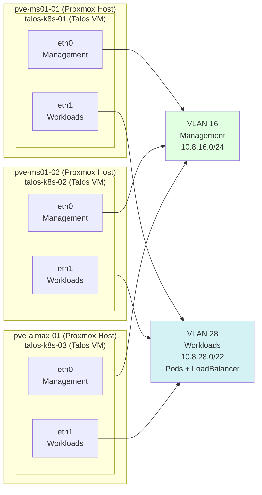

# Proxmox Homelab Network Architecture

## Overview
This document defines the network architecture for the Proxmox homelab cluster, including VLAN segmentation, subnet allocations, routing, and physical network topology.

---

## Design Philosophy

### Simplified VLAN Structure
Unlike the previous Kubernetes deployment which required extensive VLAN segmentation (management, control plane, pod network, service network, storage, load balancer), Proxmox virtualization allows for a more streamlined approach:

- **Management VLAN:** Proxmox web UI, SSH, cluster communication
- **Storage VLAN:** Ceph/shared storage traffic with jumbo frames
- **VM Network VLAN:** Guest VM networking
- **Services VLAN (Optional):** Dedicated network for exposed services

---

## VLAN Configuration

### Current VLAN Structure

**Simplified 4-VLAN design balancing security and simplicity**

| VLAN ID | Name | Subnet | Gateway | Purpose | MTU |
|---------|------|--------|---------|---------|-----|
| 1 | Default/Infrastructure | 10.0.1.0/24 | 10.0.1.1 | Network infrastructure devices | 1500 |
| **16** | **Proxmox + Talos Management** | **10.8.16.0/24** | **10.8.16.1** | **Proxmox hosts, Talos VMs, out-of-band mgmt** | **1500** |
| **28** | **K8s Workload Network** | **10.8.28.0/22** | **10.8.28.1** | **Pods + LoadBalancer IPs (1024 IPs)** | **1500** |
| **48** | **Ceph Storage** | **10.8.48.0/24** | **10.8.48.1** | **Proxmox Ceph cluster traffic** | **9000** |

**Design Notes:**
- **VLAN 16:** Combined management network for Proxmox and Talos simplifies access
- **VLAN 28:** /22 provides 1024 IPs total:
  - 10.8.28.0/24 → Node 1 pods (254 IPs)
  - 10.8.29.0/24 → Node 2 pods (254 IPs)
  - 10.8.30.0/24 → Node 3 pods (254 IPs)
  - 10.8.31.10-200 → MetalLB LoadBalancer pool (190 IPs)
- **VLAN 48:** Jumbo frames (MTU 9000) for Ceph performance
- **Talos VMs:** 2 interfaces each (eth0=management, eth1=workloads)

**Removed VLANs (simplified from original plan):**
- ~~VLAN 18~~ (K8s Control Plane VIP) - Direct connection to 10.8.16.20:6443 instead
- ~~VLAN 58~~ (K8s LoadBalancer) - Merged into VLAN 28 for simplicity

---

## Subnet Allocations

### VLAN 1 - Default/Management (10.0.1.0/24)

#### Reserved Ranges
| Range | Purpose |
|-------|---------|
| 10.0.1.1 | UDM-Pro Gateway |
| 10.0.1.2-10.0.1.50 | Network infrastructure (switches, APs, controllers) |
| 10.0.1.51-10.0.1.100 | Server management IPs (out-of-band, BMC, vPro) |
| 10.0.1.101-10.0.1.200 | DHCP pool for clients |
| 10.0.1.201-10.0.1.254 | Static assignments |

#### Current Assignments
| IP Address | Device | Type |
|------------|--------|------|
| 10.0.1.1 | UDM-Pro | Router/Gateway |
| 10.0.1.80 | USW-Flex-2.5G-K8s-Main | Switch |
| 10.0.1.82 | MikroTik-CRS309-K8s-Storage | Switch |
| 10.0.1.238 | USW-Enterprise-8-PoE-Server | Switch |
| 10.0.1.239 | Enterprise-24-PoE-Main | Switch |

---

### VLAN 16 - Management Network (10.8.16.0/24)

#### Purpose
- Proxmox web interface (port 8006)
- SSH access to Proxmox hosts
- Cluster communication (corosync)
- Talos API and kubectl access
- Out-of-band management (vPro, JetKVM)

#### IP Allocations
| IP Address | Hostname | Interface | Purpose |
|------------|----------|-----------|---------|
| 10.8.16.1 | UDM-Pro | VLAN 16 | Gateway |
| 10.8.16.10 | pve-ms01-01 | enp87s0 | Proxmox Host 1 |
| 10.8.16.11 | pve-ms01-02 | enp87s0 | Proxmox Host 2 |
| 10.8.16.12 | pve-aimax-01 | eno1 | Proxmox Host 3 |
| 10.8.16.20 | talos-k8s-01 | eth0 | Talos VM 1 (K8s API endpoint) |
| 10.8.16.21 | talos-k8s-02 | eth0 | Talos VM 2 |
| 10.8.16.22 | talos-k8s-03 | eth0 | Talos VM 3 |
| 10.8.16.92 | pve-aimax-01-kvm | JetKVM | Out-of-band management (KVM-over-IP) |
| 10.8.16.100-189 | - | - | Reserved for additional VMs |
| 10.8.16.190 | pve-ms01-01-vpro | vPro/AMT | Out-of-band management (Intel vPro) |
| 10.8.16.191 | pve-ms01-02-vpro | vPro/AMT | Out-of-band management (Intel vPro) |
| 10.8.16.192-254 | - | - | Reserved for future expansion |

---

### VLAN 28 - Workload Network (10.8.28.0/22)

#### Purpose
- **VLAN-backed Kubernetes pod networking**
- **MetalLB LoadBalancer IP pool**
- Direct routing for pod-to-pod communication (no overlay)
- High-performance pod traffic with native VLAN routing
- CNI binding interface for Talos OS nodes
- Combined workload VLAN simplifies network configuration

#### Design Notes
- **Subnet Size:** /22 provides 1024 usable IPs
- **Per-Node Allocation:** Each Talos node gets a /24 subnet for its pods
  - Node 1: 10.8.28.0/24 (254 pods)
  - Node 2: 10.8.29.0/24 (254 pods)
  - Node 3: 10.8.30.0/24 (254 pods)
- **LoadBalancer IPs:** 10.8.31.10-200 (190 IPs for MetalLB)
- **CNI:** Cilium in native routing mode
- **No NAT:** Pods use routable IPs within the cluster
- **Routing:** UDM-Pro routes between VLAN 28 and other VLANs

#### IP Allocations
| Range | Purpose |
|-------|---------|
| 10.8.28.1 | Gateway (UDM-Pro) |
| 10.8.28.0/24 | Talos node 1 pod subnet (pve-ms01-01) |
| 10.8.29.0/24 | Talos node 2 pod subnet (pve-ms01-02) |
| 10.8.30.0/24 | Talos node 3 pod subnet (pve-aimax-01) |
| 10.8.31.1-9 | Reserved |
| **10.8.31.10-10.8.31.200** | **MetalLB LoadBalancer pool (190 IPs)** |
| 10.8.31.201-254 | Reserved for expansion |

#### Talos VM Workload Interface Configuration
| Node | Interface | IP Address | Pod Subnet | MetalLB Binding |
|------|-----------|------------|------------|-----------------|
| talos-k8s-01 (pve-ms01-01) | eth1 | 10.8.28.1 | 10.8.28.0/24 | Yes |
| talos-k8s-02 (pve-ms01-02) | eth1 | 10.8.29.1 | 10.8.29.0/24 | Yes |
| talos-k8s-03 (pve-aimax-01) | eth1 | 10.8.30.1 | 10.8.30.0/24 | Yes |

#### MetalLB Configuration
```yaml
apiVersion: metallb.io/v1beta1
kind: IPAddressPool
metadata:
  name: default
  namespace: metallb-system
spec:
  addresses:
    - 10.8.31.10-10.8.31.200
  autoAssign: true
---
apiVersion: metallb.io/v1beta1
kind: L2Advertisement
metadata:
  name: default
  namespace: metallb-system
spec:
  ipAddressPools:
    - default
  interfaces:
    - eth1  # Bind to workload network interface
```

#### Common LoadBalancer Assignments (Planned)
| Service | IP Address | Port(s) | Purpose |
|---------|------------|---------|---------|
| Traefik Ingress | 10.8.31.10 | 80, 443 | Main HTTP/HTTPS ingress |
| Kubernetes Dashboard | 10.8.31.11 | 443 | K8s web UI |
| Grafana | 10.8.31.12 | 80, 443 | Monitoring dashboard |
| Prometheus | 10.8.31.13 | 9090 | Metrics collection |
| _Available_ | 10.8.31.14-200 | - | 187 IPs for future services |

---

### VLAN 48 - Storage Network (10.8.48.0/24)

#### Purpose
- Ceph cluster traffic (OSD, MON, MGR)
- High-throughput storage traffic
- Isolated from other traffic for performance

#### Design Notes
- **MTU:** 9000 (jumbo frames enabled)
- **Physical:** Dedicated 10GbE connections (SFP+ or RJ45)
- **Bonding:** LACP (802.3ad) for redundancy and throughput
- **No routing:** Isolated to storage network only

#### IP Allocations
| IP Address | Hostname | Interface | Purpose |
|------------|----------|-----------|---------|
| 10.8.48.10 | pve-ms01-01-storage | bond0 | Storage Interface (bonded 2x 10GbE) |
| 10.8.48.11 | pve-ms01-02-storage | bond0 | Storage Interface (bonded 2x 10GbE) |
| 10.8.48.12 | pve-aimax-01-storage | bond0 | Storage Interface (bonded 2x 10GbE) |
| 10.8.48.20-30 | - | - | Ceph monitor IPs (if needed) |
| 10.8.48.200-254 | - | - | Reserved for expansion |

---

## Network Topology

### Physical Network Diagram



### Logical VLAN Diagram (Simplified)



### Talos VM Network Architecture

This diagram shows how each Talos OS VM connects to VLANs using two virtual network interfaces:



**Interface Summary:**
- **eth0 (VLAN 16):** Talos API, kubectl access, cluster communication
- **eth1 (VLAN 28):** CNI binding, pod traffic, MetalLB speaker, LoadBalancer IPs

---

## Switch Configuration

### Port Assignments

#### USW-Enterprise-8-PoE-Server (10.0.1.238)
| Port | Device | Speed | VLAN Mode | VLANs | Notes |
|------|--------|-------|-----------|-------|-------|
| 1 | Uplink to Main Switch | 10G SFP+ | Trunk | All | Fiber uplink |
| 2 | pve-ms01-01 (enp87s0) | 2.5G | Tagged | **1,16,28** | Management + Workload networks |
| 3 | pve-ms01-02 (enp87s0) | 2.5G | Tagged | **1,16,28** | Management + Workload networks |
| 4 | pve-aimax-01 (eno1) | 2.5G | Tagged | **1,16,28** | Management + Workload networks |
| 5-8 | Available | - | - | - | Future expansion |

#### MikroTik CRS309-1G-8S+IN (10.0.1.82)
| Port | Device | Speed | VLAN Mode | VLANs | Notes |
|------|--------|-------|-----------|-------|-------|
| SFP+ 1 | pve-ms01-01 (enp2s0f0np0) | 10G | Tagged | **48** | Storage - Bond Member 1 |
| SFP+ 2 | pve-ms01-01 (enp2s0f1np1) | 10G | Tagged | **48** | Storage - Bond Member 2 |
| SFP+ 3 | pve-ms01-02 (enp2s0f0np0) | 10G | Tagged | **48** | Storage - Bond Member 1 |
| SFP+ 4 | pve-ms01-02 (enp2s0f1np1) | 10G | Tagged | **48** | Storage - Bond Member 2 |
| SFP+ 5-6 | pve-aimax-01 (enp1s0f0/f1) | 10G | Tagged | **48** | Storage - Bond Members |
| SFP+ 7 | Uplink to Main Switch | 10G | Trunk | All | Fiber uplink |
| SFP+ 8 | Available | - | - | - | Future expansion |

---

## Bonding Configuration

### Storage Bond (LACP 802.3ad)

#### pve-ms01-01
```
Bond: bond0
Mode: 802.3ad (LACP)
Members: enp2s0f0np0, enp2s0f1np1
Speed: 2x 10GbE = 20 Gbps aggregate
MTU: 9000
VLAN: 48 (10.8.48.10)
```

#### pve-ms01-02
```
Bond: bond0
Mode: 802.3ad (LACP)
Members: enp2s0f0np0, enp2s0f1np1
Speed: 2x 10GbE = 20 Gbps aggregate
MTU: 9000
VLAN: 48 (10.8.48.11)
```

#### pve-aimax-01
```
Bond: bond0
Mode: 802.3ad (LACP)
Members: enp1s0f0, enp1s0f1
Speed: 2x 10GbE = 20 Gbps aggregate
MTU: 9000
VLAN: 48 (10.8.48.12)
```

---

## Routing and Firewall

### Inter-VLAN Routing
All inter-VLAN routing is handled by the UDM-Pro at 10.0.1.1.

### Firewall Rules (Recommended)

#### VLAN 16 → VLAN 48 (Management → Storage)
- **Allow:** All traffic (required for VM storage access and Ceph operations)
- **No logging:** High-volume traffic

#### VLAN 28 → VLAN 16 (Workloads → Management)
- **Deny:** 10.8.28.0/22 → 10.8.16.10-12:8006 (Block pod access to Proxmox web UI)
- **Deny:** 10.8.28.0/22 → 10.8.16.10-12:22 (Block pod SSH to Proxmox hosts)
- **Deny:** 10.8.28.0/22 → 10.8.16.92 (Block pod access to JetKVM)
- **Deny:** 10.8.28.0/22 → 10.8.16.190-191 (Block pod access to vPro/AMT interfaces)
- **Allow:** 10.8.28.0/22 → 10.8.16.20-22:50000 (Allow pods to reach Talos API if needed)
- **Allow:** 10.8.28.0/22 → 10.8.16.20-22:6443 (Allow pods to reach K8s API)
- **Allow:** All other traffic (for general VM-to-VM communication)

#### VLAN 28 → Internet
- **Allow:** Outbound HTTP/HTTPS (80, 443)
- **Allow:** DNS (53)
- **Allow:** NTP (123)
- **Allow:** Common services (as needed)

#### VLAN 48 (Storage)
- **Deny:** All inter-VLAN routing except from VLAN 16
- **Isolated:** Storage traffic stays on VLAN 48 only
- **No Internet:** Block all outbound traffic

#### VLAN 1 → All
- **Allow:** Infrastructure devices can reach all VLANs for management

### Security Recommendations

Since VLAN 28 combines pods and LoadBalancer traffic, consider these additional protections:

1. **Network Policies in Kubernetes:** Use NetworkPolicies to restrict pod-to-pod communication
2. **Pod Security Standards:** Enforce restricted pod security to prevent privilege escalation
3. **Service Mesh (optional):** Consider Cilium's security features for L7 policy enforcement

---

## DNS Configuration

### DNS Servers
| Type | IP Address | Provider |
|------|------------|----------|
| Primary DNS | 10.0.1.1 | UDM-Pro (local) |
| Secondary DNS | 1.1.1.1 | Cloudflare |
| Tertiary DNS | 8.8.8.8 | Google |

### Local DNS Zones
Consider creating local DNS entries for:
- `pve-ms01-01.lab.local` → 10.8.16.10
- `pve-ms01-02.lab.local` → 10.8.16.11
- `pve-aimax-01.lab.local` → 10.8.16.12
- `talos-k8s-01.lab.local` → 10.8.16.20
- `talos-k8s-02.lab.local` → 10.8.16.21
- `talos-k8s-03.lab.local` → 10.8.16.22
- `k8s-api.lab.local` → 10.8.16.20 (primary API endpoint)
- `traefik.lab.local` → 10.8.31.10 (ingress)

---

## Network Performance Targets

### Expected Throughput
| Link Type | Expected Speed | Technology |
|-----------|---------------|------------|
| Management | 2.5 Gbps | Copper Cat6 |
| Storage (per link) | 10 Gbps | SFP+ DAC/Fiber |
| Storage (bonded) | 20 Gbps | LACP aggregate |
| VM Network | 2.5 Gbps | Shared with management |

### Latency Targets
| Path | Target Latency |
|------|----------------|
| Host to Host (same VLAN) | < 0.5ms |
| VM to VM (same host) | < 0.1ms |
| VM to VM (different host) | < 1ms |
| Storage network | < 0.5ms |

---

## Network Testing

### Commands for Validation

#### Test Jumbo Frames (Storage Network)
```bash
# From pve-ms01-01 to pve-ms01-02
ping -M do -s 8972 -c 10 10.8.48.11
```

#### Test Storage Throughput
```bash
# iperf3 server on pve-ms01-02
iperf3 -s -B 10.8.48.11

# iperf3 client on pve-ms01-01
iperf3 -c 10.8.48.11 -B 10.8.48.10 -t 30 -P 4
```

#### Test Bond Status
```bash
cat /proc/net/bonding/bond0
```

#### Verify VLAN Configuration
```bash
ip addr show
bridge vlan show
```

---

## Network Monitoring

### Recommended Monitoring
- **UniFi Controller:** Built-in traffic graphs and statistics
- **Proxmox:** Built-in network graphs per host and VM
- **LibreNMS/Observium:** SNMP monitoring for switches
- **Grafana + Prometheus:** Advanced metrics and alerting

### Key Metrics to Monitor
- Interface utilization (%)
- Packet loss and errors
- Latency (inter-host ping)
- Bond status and member health
- VLAN traffic distribution
- Storage network throughput

---

## Troubleshooting

### Common Issues

#### Jumbo Frames Not Working
- Verify MTU on all devices in the path (NICs, switch ports, bond)
- Check switch VLAN configuration allows large frames
- Ensure no intermediate devices have MTU 1500 limitation

#### LACP Bond Not Forming
- Verify switch has LACP enabled on ports
- Check both bond members are on the same switch
- Ensure switch ports are in the same port-channel/LAG

#### Inter-VLAN Routing Issues
- Verify VLAN interfaces on UDM-Pro
- Check firewall rules allow desired traffic
- Confirm routing table on UDM-Pro

#### Slow Storage Performance
- Check bond status (both members active?)
- Verify jumbo frames enabled and working
- Monitor switch port statistics for errors
- Test with iperf3 to isolate storage vs. network issues

---

**Last Updated:** 2025-11-03
**Document Version:** 1.0
**Maintained By:** Jason
